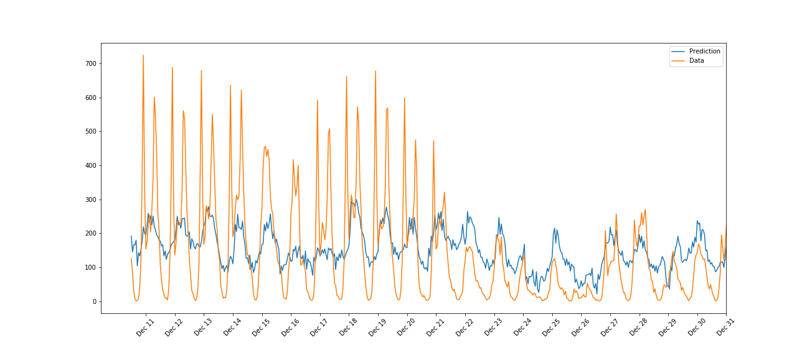

# UDACITY_DEEP_LEARNING_NANODEGREE_project1.Predicting_Bike_Sharing_patterns

# 1. Abstract

### 1. Purpose

The purpose of this project is to predict number of bike rental for days, hours


### 2. Input data

Input data is csv file that includes number of bike sharing for days, hours, weekdays, weather etc


For feeding this data to Neuaral Net and tunning weights, we need to some data tunnings


# 2. Background Learning


### 1. Introduction to Neural Net


### 2. Gradient Descent


### 3. Training Neural Network


# 3. Code Flow

Firstly, we need to preprocess data

We don't have to use all of data we have

So we have to check what important variables is, and devide into three parts (train, validation, test)

Secondly, we will use preprocessed data to predict result

We have to decide the architecture of NeuralNet, size, loss function, ...

I had to spend much time to tuning hyperparameters like learning rate, number of epochs, size of hidden nodes


### 1. Preparing Data

###### 1. Loading and preparing data

```python
data_path = 'Bike-Sharing-Dataset/hour.csv'

rides = pd.read_csv(data_path)

rides.head()
```


###### 2. Checking out the data

I checked and plotted for 10 days data

```python
rides[:24*10].plot(x='dteday', y='cnt')
```


###### 3. Dummify variables

For example, month has 12 values (1~12)

But December doesn't mean that it has much valuable than January

Because we put numbers to our Neural Net by x (input layer),
we need to set all variables to equal value (0 or 1)

And that variables are season, weather, month, hour, weekday

```python
dummy_fields = ['season', 'weathersit', 'mnth', 'hr', 'weekday']
for each in dummy_fields:
    dummies = pd.get_dummies(rides[each], prefix=each, drop_first=False)
    rides = pd.concat([rides, dummies], axis=1)

fields_to_drop = ['instant', 'dteday', 'season', 'weathersit', 
                  'weekday', 'atemp', 'mnth', 'workingday', 'hr']
data = rides.drop(fields_to_drop, axis=1)
data.head()
```


###### 4. Scaling target variables

For example, number of rental for an hour can be 0 or even 10,000

It can have too much difference and it can make distortion for Neuaral Net calculation

So we have to scaling to equal range that have 0 mean and 1 standard deviation

That variables are total rental number, registered number, casueal number, temperature, humidity, windspeed

```python
quant_features = ['casual', 'registered', 'cnt', 'temp', 'hum', 'windspeed']
# Store scalings in a dictionary so we can convert back later
scaled_features = {}
for each in quant_features:
    mean, std = data[each].mean(), data[each].std()
    scaled_features[each] = [mean, std]
    data.loc[:, each] = (data[each] - mean)/std
```


###### 5. Splitting data into training, validation, testing sets

```python
test_data = data[-21*24:]

data = data[:-21*24]

target_fields = ['cnt', 'casual', 'registered']

features, targets = data.drop(target_fields, axis=1), data[target_fields]

test_features, test_targets = test_data.drop(target_fields, axis=1), test_data[target_fields]

train_features, train_targets = features[:-60*24], targets[:-60*24]

val_features, val_targets = features[-60*24:], targets[-60*24:]
```


### 2. Training , valiation, test

I did not included source code, please check .py files

Below is flow of parameter tunnings


###### 1. Training data

```python

from my_answers import NeuralNetwork
import sys
from my_answers import iterations, learning_rate, hidden_nodes, output_nodes

N_i = train_features.shape[1]

###### I will provide this code explanation blow ######
network = NeuralNetwork(N_i, hidden_nodes, output_nodes, learning_rate)

losses = {'train':[], 'validation':[]}
for ii in range(iterations):
    # Go through a random batch of 128 records from the training data set
    batch = np.random.choice(train_features.index, size=128)
    X, y = train_features.ix[batch].values, train_targets.ix[batch]['cnt']
    
    ###### I will provide this code explanation blow ######
    network.train(X, y)
    
    # Printing out the training progress
    train_loss = MSE(network.run(train_features).T, train_targets['cnt'].values)
    val_loss = MSE(network.run(val_features).T, val_targets['cnt'].values)
    sys.stdout.write("\rProgress: {:2.1f}".format(100 * ii/float(iterations)) \
                     + "% ... Training loss: " + str(train_loss)[:5] \
                     + " ... Validation loss: " + str(val_loss)[:5])
    sys.stdout.flush()
    
    losses['train'].append(train_loss)
    losses['validation'].append(val_loss)
    
```

###### 2. Explanation for NeuralNetwork initiation

```python

class NeuralNetwork(object):
    def __init__(self, input_nodes, hidden_nodes, output_nodes, learning_rate):
        # Set number of nodes in input, hidden and output layers.
        self.input_nodes = input_nodes
        self.hidden_nodes = hidden_nodes
        self.output_nodes = output_nodes

        # Initialize weights
        self.weights_input_to_hidden = np.random.normal(0.0, self.input_nodes**-0.5, 
                                       (self.input_nodes, self.hidden_nodes))

        self.weights_hidden_to_output = np.random.normal(0.0, self.hidden_nodes**-0.5, 
                                       (self.hidden_nodes, self.output_nodes))
        self.lr = learning_rate
        
        # I selected activation function f(x) = sigmoid
        self.activation_function = lambda x : 1 / (1 + np.exp(-x))
        
```

###### 3. Explanation for NeuralNetwork.train method

```python

class NeuralNetwork(object):
    def train(self, features, targets):

        n_records = features.shape[0]
        delta_weights_i_h = np.zeros(self.weights_input_to_hidden.shape)
        delta_weights_h_o = np.zeros(self.weights_hidden_to_output.shape)
        for X, y in zip(features, targets):
            
            # Implement the forward pass
            final_outputs, hidden_outputs = self.forward_pass_train(X)  
            # Implement the backproagation
            delta_weights_i_h, delta_weights_h_o = self.backpropagation(final_outputs, hidden_outputs, X, y, 
                                                                        delta_weights_i_h, delta_weights_h_o)
            
        self.update_weights(delta_weights_i_h, delta_weights_h_o, n_records)
```
```python

    def forward_pass_train(self, X):

        # signals into hidden layer
        hidden_inputs = np.dot(X, self.weights_input_to_hidden) 
        # signals from hidden layer
        hidden_outputs = self.activation_function(hidden_inputs) 

        final_inputs = np.dot(hidden_outputs, self.weights_hidden_to_output) # signals into final output layer
        # Project guide required final activation f(x) = x
        # signals from final output layer
        final_outputs = final_inputs 
        
        return final_outputs, hidden_outputs
```
```python
    def backpropagation(self, final_outputs, hidden_outputs, X, y, delta_weights_i_h, delta_weights_h_o):

        # Output layer error is the difference between desired target and actual output.
        error = y- final_outputs       
        output_error_term = error # * final_outputs * (1 - final_outputs)
        
        hidden_error = np.dot(output_error_term, self.weights_hidden_to_output.T)
        hidden_error_term = hidden_error * hidden_outputs * (1 - hidden_outputs)
        
        # Weight step (input to hidden)
        ### changed after first feedback (190523) ###
        ### delta_weights_i_h += self.lr * hidden_error_term * X[:, None]
        delta_weights_i_h += hidden_error_term * X[:, None]
        
        # Weight step (hidden to output)
        ### changed after first feedback (190523) ###
        ### delta_weights_h_o += self.lr * output_error_term * hidden_outputs[:, None]
        delta_weights_h_o += output_error_term * hidden_outputs[:, None]
        
        return delta_weights_i_h, delta_weights_h_o
```


<여기부터는 전체 과정은 표로 정리하고 최종 결과만 스크린샷 첨부>


*Test One*

| Trial |   Learning Rate   |   Hidden Nodes   |   Iteration   |              Explanation                  |
| ----- | -------           | -------          |  -------      |                 ------                    |
|  1    |        0.1        |        2         |       100     | Loss gets down, it means bad architecture |
|  2    | 0.2811 |
|  3    | 0.4542 |
|  4    | 0.7827 |


### 1. Learning Rate = 0.1, Hidden Nodes = 2, Iteration = 100 (orininal set)


We can see validation loss is down getting down at loss graph

That means it doesn't have correct architecture

So I raised the hidden nodes

### 2. Learning Rate = 0.1, Hidden Nodes = 100, Iteration = 100


This time but validation loss exploded

So I lowered the hidden nodes

### 3. Learning Rate = 0.1, Hidden Nodes = 50, Iteration = 100


This time, validation loss is not exploded but increased slowely

So I lowered the hidden nodes more

### 4. Learning Rate = 0.1, Hidden Nodes = 25, Iteration = 100


Thie time, validation loss is slowly getting down

So I lowered the hidden nodes more

### 5. Learning Rate = 0.1, Hidden Nodes = 13, Iteration = 100


This time, validation loss increased slowely

So I raised the hidden nodes a little

### 6. Learning Rate = 0.1, Hidden Nodes = 20, Iteration = 100


This time again, validation loss increased slowely

So I raised the hidden nodes a little

### 7. Learning Rate = 0.1, Hidden Nodes = 30, Iteration = 100


This time again, validation loss increased slowely

So I concluded 25 is adaquate

And next time, I raised learning rate to decrease error more fastly

### 8. Learning Rate = 0.5, Hidden Nodes = 25, Iteration = 100




It was effective

So I raised more

### 9. Learning Rate = 1.0, Hidden Nodes = 25, Iteration = 100


It excluded

So I concluded learning rate = 0.5 is adaquate

Now its time to iteration

I just put very high number to iteration

### 10. Learning Rate = 0.5, Hidden Nodes = 25, Iteration = 7000


Seeing loss graph, we can find val loss is inclined after 6500 iterations

So I concluded iteration = 6500 is adaquate

### 11. Learning Rate = 0.5, Hidden Nodes = 25, Iteration = 6500


# Conclusion & Discussion

### 1. Meaning

I already used Keras and TensorFlow library at Self Driving Car Nanodegree program

Especially at Keras, it was possible to implement not only simple Neural Net but also complex and famous architectures

even if I don't understand principle of Neural Net

At that time, I thought I understood everything of Neural Net

But this time was very good chance for me to studying Neural Net

especially the mathmatical principle of Forward propagation, Backpropagation

### 2. About architecture

This project confined architectures to just 1 hidden layer Neural Net

So there were only 3 variables I can adjust

It was learning rate, number of hidden nodes, iterations

Of course on the contrary, thanks to it, it was good time to feel the effects of that variables

But if I can change architecture more complex, I will get better result


